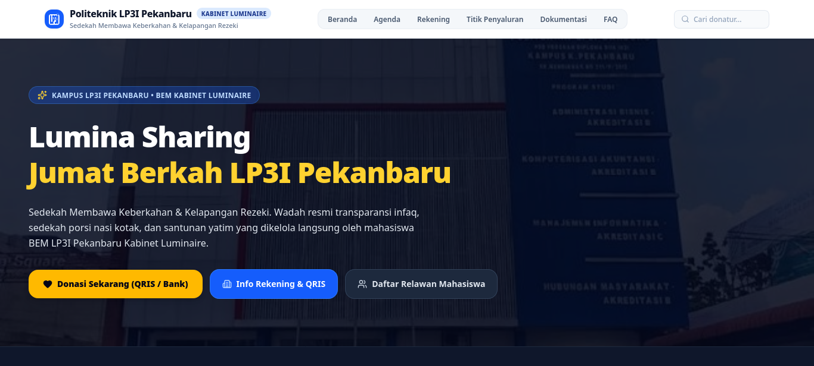

# Lumina Sharing - Jumat Berkah LP3I Pekanbaru

  

## Tentang Program
**Lumina Sharing Jumat Berkah** adalah sebuah platform transparansi pengelolaan dana infaq, donasi, dan sedekah yang dikembangkan khusus untuk **BEM Politeknik LP3I Pekanbaru (Kabinet Luminaire)**. Website ini berfungsi sebagai portal informasi publik sekaligus dasbor manajemen keuangan (kas) untuk program sosial mingguan.

Program "Jumat Berkah" merupakan aksi pengumpulan sumbangan dari seluruh civitas akademika kampus, yang kemudian disalurkan kembali kepada masyarakat yang membutuhkan (seperti driver ojol, panti asuhan, kaum dhuafa, dan pejuang jalanan) dalam bentuk paket nasi kotak bergizi serta santunan.

## Fitur Utama

### 👁️ Portal Publik Transparan
- **Monitoring Saldo Real-Time:** Menampilkan secara terbuka total donasi masuk, total biaya operasional/penyaluran, serta sisa saldo kas yang mengendap.
- **Live Update Titik Penyaluran:** Publik dapat melihat progres penyaluran di tiap titik lokasi secara langsung.
- **Daftar Donatur Terbuka:** Transparansi donatur terbaru yang tercatat di dalam sistem (tanpa mengekspos data pribadi sensitif).
- **Galeri Dokumentasi:** Album kegiatan lapangan dan penyaluran di jalanan yang dapat diakses oleh umum.
- **Konfirmasi Donasi Instan:** Tersedia QRIS khusus dan tombol konfirmasi otomatis yang terhubung dengan nomor WhatsApp BEM.

### 🔐 Manajemen Admin (Dashboard)
- **Pencatatan Keuangan Terstruktur:** Modul bagi admin untuk mencatat transaksi *Pemasukan (Donasi)* dan *Pengeluaran (Belanja/Santunan)*.
- **Manajemen Titik Penyaluran:** Admin dapat membuat, memperbarui status, dan menyelesaikan target titik lokasi pembagian setiap hari Jumat.
- **Manajemen Galeri:** Kemudahan unggah foto dokumentasi (Terintegrasi Cloud Storage).
- **Pengaturan Dinamis:** Admin bebas memperbarui target bulanan, mengganti foto QRIS, dan mengubah kontak WhatsApp konfirmasi kapan saja.
- **Multi-Admin Management:** Admin utama dapat mendaftarkan atau mencabut hak akses pengurus BEM lain secara langsung dari dashboard.
- **Backup & Restore Data:** Pengamanan mandiri di mana admin dapat mengekspor seluruh basis data ke dalam file `.json` sebagai cadangan luring.

## 💻 Tech Stack
Proyek ini dibangun menggunakan teknologi modern untuk memastikan performa yang cepat, aman, dan mudah di-maintain:

  
  
  
  
   
  
  
  

- **Frontend:** React.js, TypeScript, Vite, Tailwind CSS.
- **Backend & Database:** Supabase (PostgreSQL, Supabase Auth, Cloud Storage).
- **Deployment & Serverless API:** Vercel.

---
*Dikelola dengan penuh integritas oleh Kementerian Sosial dan Masyarakat - BEM Politeknik LP3I Pekanbaru Kabinet Luminaire.*
